# LMS-Convergence-Simulation-and-Modeling
The LMS (Least Mean Squares) Convergence Simulation and Modeling project aims to simulate the adaptive filtering process using the LMS algorithm.

### Functionality:

This MATLAB script simulates the convergence behavior of an adaptive filter using the Least Mean Squares (LMS) algorithm. It evaluates the performance through Mean Square Error (MSE) and Excess Mean Square Error (EMSE), comparing simulation results with theoretical models.

### Technical Explanation:

#### Inputs:

	•	RLZ: Number of Monte Carlo realizations.
	•	mu: Step size parameter for the LMS algorithm.
	•	N: Length of data sequences.

#### Outputs:

	•	Plots and evaluations of:
	•	Weight evolution of the adaptive filter.
	•	Mean Square Error (MSE) and theoretical MSE.
	•	Excess Mean Square Error (EMSE) and theoretical EMSE.

#### Procedure:

	Simulation Parameters Setup:

	•	Defines the number of realizations (RLZ), step size (mu), and data length (N).
    
    System Parameters Setup:

	•	Defines the system coefficients (wopt), system order (L), input correlation (rho), and noise variance (varn).
	
    Monte Carlo Filtering Process:

	•	Iteratively performs the following for each realization:
	•	Generates input (x) and output (y) signals with noise (z).
	•	Estimates the output (d) using the adaptive filter.
	•	Updates filter weights (w) using the LMS algorithm based on input and estimation error (en).
	•	Computes MSE (e2) and EMSE (exe2).
	
    Theoretical Model Calculation:

	•	Constructs a theoretical model based on:
	•	Correlation matrix (R).
	•	Weight evolution (vt) using the LMS update rule.
	•	Calculates theoretical MSE (e2t) and EMSE (exe2t).
	
    Illustration:

	•	Plots weight evolution over iterations.
	•	Plots MSE and EMSE convergence comparing simulation and theoretical results.

### Flowchart
